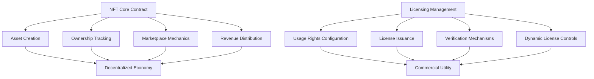

# Full Ethereum Platform

A comprehensive blockchain infrastructure solution providing advanced NFT and licensing capabilities on the Stacks blockchain.

## Overview

Full Ethereum Platform offers a robust, modular blockchain ecosystem that enables:
- Advanced NFT minting and management
- Sophisticated licensing and usage rights frameworks
- Decentralized ownership and trading mechanisms
- Flexible economic models for digital assets

## Key Features

Our platform provides developers and creators with:
- Flexible NFT creation and lifecycle management
- Multi-tier licensing and usage rights
- Transparent royalty and revenue distribution
- Secure, auditable smart contract infrastructure

## Architecture

The platform is built on two core smart contract modules:



## Contract Documentation

### NFT Core (`nft-core.clar`)

Manages fundamental NFT infrastructure:
- Asset creation and ownership tracking
- Marketplace listing and trading
- Royalty calculation and distribution
- Metadata management

### Licensing Manager (`licensing-manager.clar`)

Provides comprehensive licensing capabilities:
- Configurable usage rights models
- Tiered licensing frameworks
- Dynamic license validation
- Usage tracking and enforcement

## Getting Started

### Prerequisites
- Clarinet
- Stacks wallet
- STX tokens for transactions

### Basic Usage

1. Creating a story:
```clarity
(contract-call? .storynest-core create-story "metadata-uri" u100)
```

2. Listing a story for sale:
```clarity
(contract-call? .storynest-core list-story story-id price)
```

3. Configuring a license:
```clarity
(contract-call? .storynest-licensing configure-license-tier story-id token-id tier price duration-days max-licenses)
```

## Function Reference

### Core Contract Functions

#### Story Management
```clarity
(create-story (metadata-uri (string-utf8 256)) (royalty-percentage uint))
(update-story-metadata (story-id uint) (new-metadata-uri (string-utf8 256)))
(freeze-story-metadata (story-id uint))
```

#### Trading
```clarity
(list-story (story-id uint) (price uint))
(buy-story (story-id uint))
(make-offer (story-id uint) (offer-price uint) (expiry uint))
(accept-offer (story-id uint) (offerer principal))
```

### Licensing Functions

#### License Management
```clarity
(configure-license-tier (story-id uint) (token-id uint) (tier uint) (price uint) (duration-days uint) (max-licenses (optional uint)))
(purchase-license (story-id uint) (token-id uint) (tier uint))
(renew-license (story-id uint) (token-id uint) (tier uint))
(revoke-license (story-id uint) (token-id uint) (tier uint) (licensee principal))
```

## Development

### Testing
Run tests using Clarinet:
```bash
clarinet test
```

### Local Development
1. Start local chain:
```bash
clarinet integrate
```

2. Deploy contracts:
```bash
clarinet deploy
```

## Security Considerations

### Core Contract
- Royalty calculations use basis points to avoid floating-point issues
- Ownership checks prevent unauthorized transfers
- Metadata freezing prevents post-sale modifications

### Licensing Contract
- License validation prevents unauthorized usage
- Expiration tracking ensures proper access control
- Creator-only license configuration and revocation
- Maximum license count enforcement

### General
- All financial transactions verify sufficient funds
- Access control checks on privileged operations
- State changes are atomic and consistent